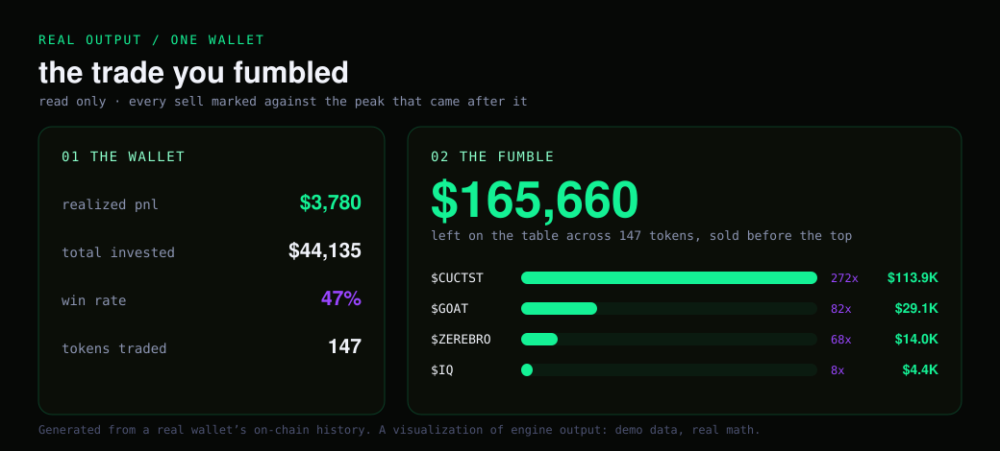
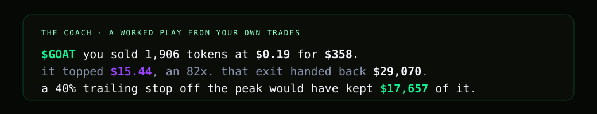

<div align="center">


# FOMOTH

**A second brain for your memecoin trading on Solana and Robinhood Chain. Paste a wallet, see what you fumbled.**


[](https://github.com/FomothFumble/fomoth/actions/workflows/ci.yml)
[](LICENSE)


**[fomoth.com](https://fomoth.com)** — paste a wallet, it runs there

[Quick start](#quick-start) · [Demo](#demo) · [How it works](#the-fumble-precisely) · [The coach](#the-coach) · [Architecture](#architecture) · [Roadmap](#roadmap)

</div>

Every tracker shows you dry PnL for taxes. FOMOTH computes the number nobody else does: **how much
you left on the table by selling before the top.** It reads your trades off the chain, marks every
sell against the peak that came after it, grades the habits that cost you, and coaches you from your
own history with worked, per-token examples.

The name is the whole thesis in one image: a moth flying into the candle of a pump. Drawn to the
light, burned by it. That is FOMO, and the fumble is what it cost you.

**Try it in 30 seconds.** The engine and its tests build and run locally with no wallet, no key and
no network. Point it at a wallet only when you want a real report.

> [!NOTE]
> FOMOTH reads a **public** wallet address, never a private key, and never signs or sends anything.
> The visuals below use one real wallet's on-chain history to show the output; the math is
> documented in the source, not hidden.

## What it computes

- **The regret engine.** For every sell, the highest price the token reached afterward, valued and
  summed into the dollars you left on the table, plus the peak multiple you missed.
- **Coach metrics.** Expectancy, payoff, win rate and the median hold times, from your own trades.
  It measures whether you cut winners early and marry losers, in numbers.
- **Worked plays.** Concrete, per-token advice: the price you sold at, where it went, and the exact
  dollars a specific rule (a trailing stop, a hard stop) would have saved on that exact trade. No
  generic "hold longer."

## Demo

<div align="center">

</div>

*A visualization of engine output on one real wallet. Demo data, real math.* The `fumble` CLI takes
a wallet's sells and daily candles on stdin and prints the same numbers as JSON, so the core is
usable on its own and easy to test:

```bash
printf '1\nTKN 3 2\n0 2 1\n86400 10 3\n172800 5 4\n0 100\n172800 50\n' | ./build/core/fumble
# {"total_fumble":950,"priced":1,"tokens":[{"mint":"TKN","sold_tokens":150,"fumble_usd":950,"peak_mult":1.25,...}]}
```

## Robinhood Chain

Paste a `0x…` address, or flip the chain switch above the input, and the same report runs on
Robinhood Chain (chain id 4663) in a Robinhood-green skin. There is no wallet-PnL provider for this
chain, so `fomoth/robinhood.py` reads it directly from the public RPC:

- **Trades.** Every ERC-20 transfer into or out of the wallet, grouped by transaction. A token worth
  $0.50 or more per unit (USDG, tokenized stocks, WETH) is money; anything cheaper is the memecoin.
  Bot routes hop ETH → WETH → a quote token → the launchpad curve and net to zero on the wallet, so a
  trade is priced by its largest money leg, and native-ETH payouts are read off the curve or
  Uniswap v4 event.
- **The peak after your exit.** Block-exact: every launchpad curve fill after your last sell is
  priced in the curve's own quote token, and the maximum is the peak you missed. GeckoTerminal
  candles are only a small fallback for tokens that graduated to a pool.
- **Caveats.** Dollar values use today's price of the quote token (USDG is a dollar and stock
  tokens move slowly). The first report for a wallet takes a minute or two on the public RPC, then
  it is cached.

## The fumble, precisely

The fumble is not "what if you sold the exact top" hindsight. It is measured per sell, against the
peak that came **after** that specific sell, and summed:

```
fumble = Σ  tokens_sold × max(0, peak_high_after_that_sell − price_at_that_sell)
```

Worked on the demo values above: you sold 100 tokens on day 0 at \$1 while the token later ran to a
high of \$10, which is `100 × (10 − 1) = $900`. A second sell of 50 on day 2 at \$4 against a later
high of \$5 adds `50 × (5 − 4) = $50`. Total left on the table: **\$950**. The peak multiple is the
top after your last exit over that exit price.

The engine builds a suffix-max over the daily highs so "the peak after day *i*" is an O(1) lookup,
then binary-searches each sell into the series. It stays fast over a wallet with thousands of fills.

## The coach

No horoscopes. Every play is your own trade, priced, with the exact dollars a rule would have kept.

<div align="center">

</div>

Behind the copy are the aggregate metrics: expectancy per trade, payoff (average win over average
loss), win rate, and the median hold time for winners versus losers. When the median winner is held
minutes and the median loser hours, the coach says it in dollars and hands you the rule.

## Architecture

<div align="center">

</div>

The compute-heavy pass is **C++**; the data, orchestration and the web layer are **Python**. The two
talk over a tiny process boundary, and the Python side falls back to a pure implementation when the
native core is not built, so the project works with or without a compiler.

- **`core/` — C++17 engine.** The regret engine (`regret.cpp`, suffix-max + binary search per sell)
  and the coach metrics (`coach.cpp`). Shipped as a static library, the `fumble` CLI and its own
  unit tests, all built and run in CI.
- **`fomoth/` — Python package.** Solana Tracker client, price history, trade derivation from
  balance deltas, the report builder, the coach copy and a stdlib-only web server.
- **`fomoth/native.py` — the bridge.** Serialises the inputs, runs `fumble`, parses its JSON, and
  falls back to `fomoth/regret.py` when the binary is absent.

## Quick start

Building the core needs a C++17 compiler and CMake.

```bash
cmake -S . -B build -DCMAKE_BUILD_TYPE=Release
cmake --build build --parallel
ctest --test-dir build --output-on-failure   # C++ unit tests
```

or just `scripts/build.sh`. The Python layer discovers `build/core/fumble` automatically.

Run a report (needs a free [Solana Tracker](https://www.solanatracker.io/data-api) key):

```bash
python -m fomoth <wallet-address>
SOLANATRACKER_KEY=... python -m fomoth.server 8090   # then open localhost:8090
```

## How it reads a trade

FOMOTH does not decode any DEX. For each transaction it looks at how the balances moved: a memecoin
up and SOL down is a buy, a memecoin down and SOL in is a sell. That one rule works across pump.fun,
Raydium and Jupiter because they all end in the same balance change. The method is in
[`fomoth/trades.py`](fomoth/trades.py), and the maths is documented, not hidden.

## What FOMOTH is not

- Not a signals group, not a caller, not financial advice. It is a mirror for trades you already made.
- Not custodial and not a wallet. It never asks for a key and never sends a transaction.
- Not a backtester that promises future returns. It reprices your real, closed history.

## Repository structure

```text
assets/                        banner, architecture, demo and coach panels (SVG)
core/                          C++17 engine: regret + coach, CLI, unit tests, CMake
fomoth/                        Python: reader, prices, trades, report, coach, server, bridge
web/                           demo page (rendered report)
scripts/                       build.sh, run.sh
.github/workflows/ci.yml       builds the core, runs ctest and the Python↔C++ bridge end to end
```

## Roadmap

- [x] Trade derivation from balance deltas (DEX-agnostic)
- [x] C++ regret engine + coach metrics, tested in CI
- [x] Report, coach copy and web demo
- [ ] Habit detector (buying tops, cutting winners, revenge trades, overtrading)
- [ ] In-process bindings (pybind11) to drop the subprocess hop
- [ ] Multi-wallet aggregation

## License

MIT. See [LICENSE](LICENSE).
