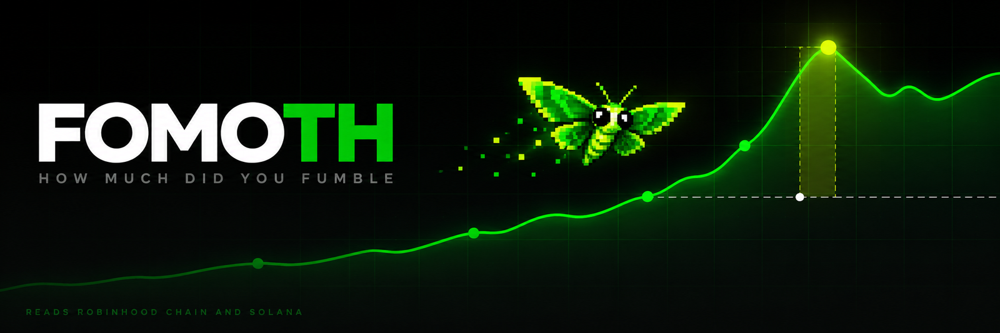

<div align="center">



[](https://fomoth.com)
[](https://github.com/FomothFumble/fomoth/actions/workflows/ci.yml)
[](https://github.com/FomothFumble/fomoth)
[](LICENSE)

</div>

### The number nobody computes for you

Your PnL says what you made. It says nothing about the token you closed at two times that ran forty
times an hour later, and that trade is usually the whole story of the year. FOMOTH prices exactly
that. Paste a public address, and every sell you ever made gets marked against the highest price the
token reached after you were out.

One wallet from the test set: 43 tokens traded, 1,207 dollars realised, 19,679 dollars left behind.
The picking was fine. A payoff of 2.93 on a 47 percent hit rate is a real edge. The exits ate it.

### What it actually reads

Two chains, two very different paths to the same arithmetic.

**Solana.** Trades come from the wallet's own history, peaks from a price API, and every peak above
fifteen times gets re-checked against hourly and daily candles before it is allowed into a report. A
broken all time high is the easiest way to invent a fake fumble, so a peak that cannot be reproduced
in candles is lowered to what the candles show, or dropped.

**Robinhood Chain.** No indexer exists for it, so the reader is ours. A public RPC, a few thousand
`eth_getLogs`, transfers grouped back into transactions, launchpad curve words and Uniswap v4 swaps
decoded from receipts, and the quote token worked out per curve from the amounts in the same
transaction. The peak after an exit is read block exact off the curve itself rather than from
candles, which on a chain producing ten blocks a second is the difference between a real number and
a rounded one.

That last part is measured without trusting any price at all: a wallet's exit is scored as a fill
ratio against the best fill the curve ever gave afterwards, so a mispriced quote token cannot turn a
700 dollar fumble into a 3.9 trillion dollar one. It did, once. That is why the method changed.

### The pipeline

| stage | what it does |
|---|---|
| reader | pulls the wallet's trades, one path per chain, nothing cached between wallets |
| prices | values every fill in dollars at the time it happened |
| regret | for each sell, the top that followed it, the multiple missed and the dollars left |
| verify | re-checks suspicious peaks against independent candles, lowers or drops them |
| coach | expectancy, payoff, win rate, median hold for winners against losers |
| report | the verdict, the ghost curve, the biggest fumbles and the rules worth applying |

The regret engine and the coach are C++17 with their own unit tests. Python does the reading, the
pricing and the serving, and calls the engine across a thin bridge. CI builds the core, runs ctest
and then runs the bridge end to end, so a change to the arithmetic cannot land quietly.

### What comes back

A verdict in one line, then the ghost curve: what the wallet actually kept against what the same
trades held to the top would have been worth. Under it, every fumble ranked by dollars, the worst
ones worked through trade by trade, and a set of exit rules replayed over that wallet's own history
with the dollars each one would have added. Not advice, a replay.

### Ground rules

- **Read only, always.** A public address goes in. No key, no signature, no transaction, nothing
  leaves the page but the address you typed.
- **A peak that cannot be verified does not count.** Better a smaller fumble than a fake one.
- **Small samples are called small.** Six winners out of 147 entries is a wide interval, not a law.
- **Computed numbers carry the moment they were computed.** A replay is never dressed as live.

### Run it yourself

```bash
git clone https://github.com/FomothFumble/fomoth
cd fomoth

# engine and tests, no wallet, no key, no network
cmake -S . -B build -DCMAKE_BUILD_TYPE=Release && cmake --build build --parallel
ctest --test-dir build --output-on-failure

# the site, on your own machine
python -m fomoth.server 8090          # robinhood chain works with no key at all
SOLANATRACKER_KEY=... python -m fomoth.server 8090   # add a free key for solana
```

Then open `localhost:8090` and paste an address. The first Robinhood report on a busy wallet takes a
couple of minutes because a public RPC rate limits; after that it is cached.

### Layout

```text
core/      C++17 regret engine and coach, CLI, unit tests
fomoth/    python: chain readers, prices, trades, report, coach, server
web/       the site, one page, no build step
assets/    banner and the mascot
```

### License

MIT. Take it apart, run it on your own wallet, tell it what it got wrong.
